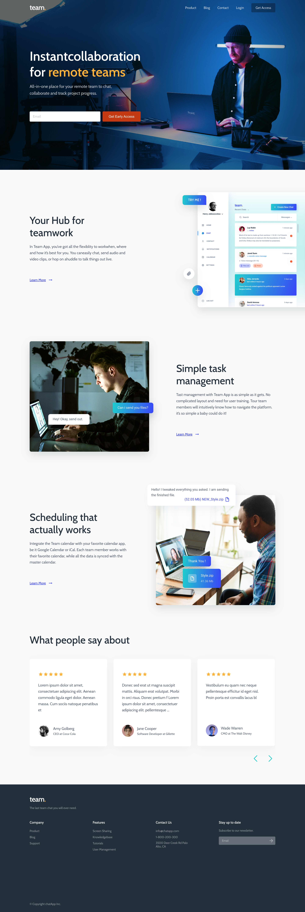
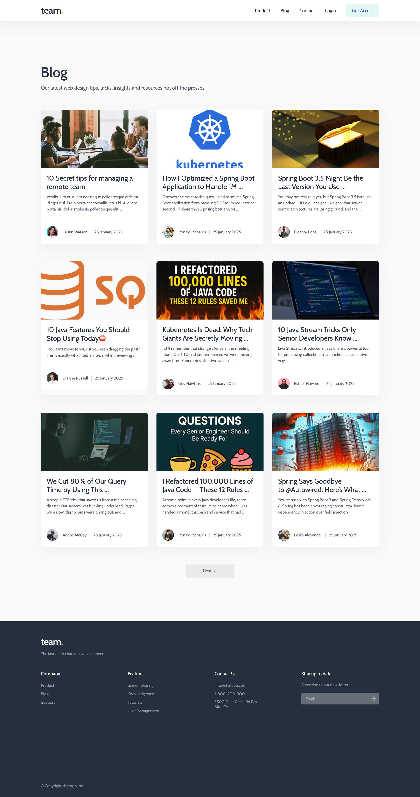
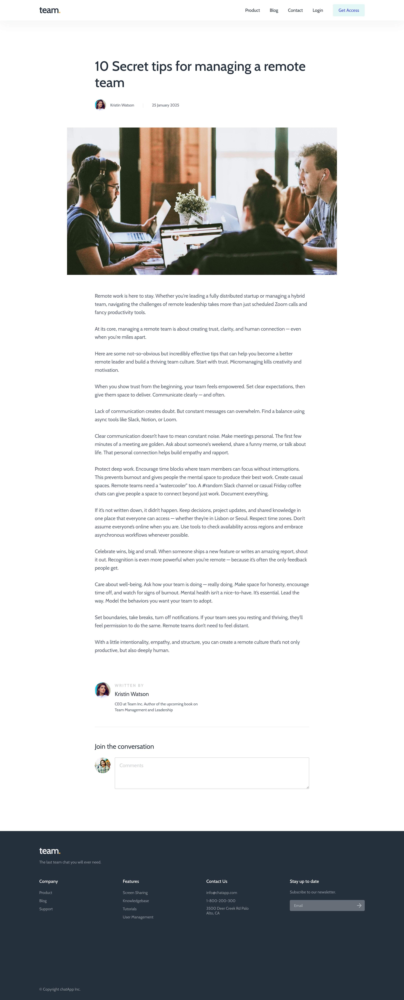
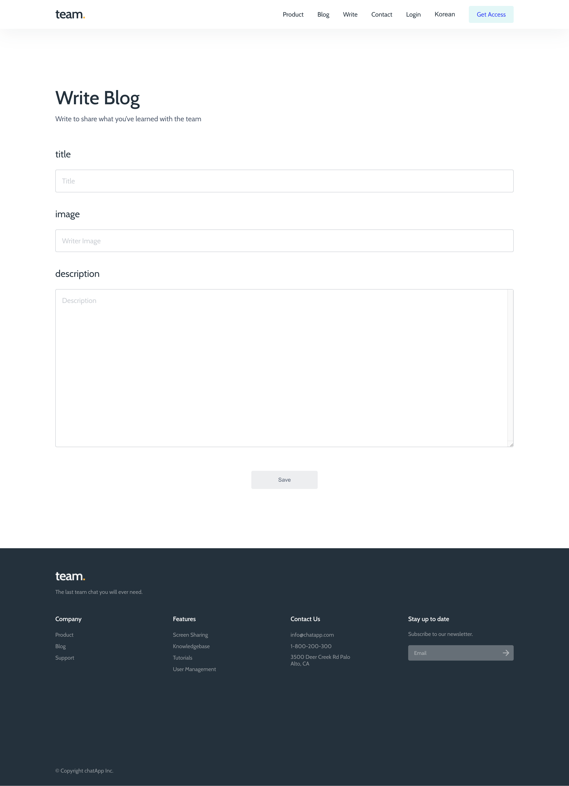

# 🧑‍💻 Team App - Instant Collaboration for Remote Teams

> 👥 원격 팀을 위한 협업 플랫폼  
> 블로그, 일정, 팀 관리 등 다양한 기능으로 **실시간 협업 환경**을 제공합니다.

단순한 레이아웃이지만, HTML 구조부터 시맨틱 태그 활용, ARIA 속성, 키보드 네비게이션 가능 여부까지 웹 표준과 웹 접근성을 철저히 고려하여 구현한 프로젝트입니다.
특히 시각적 디자인보다 누구나 접근 가능한 웹을 만드는 데 집중하였으며, Lighthouse 및 W3C 검사도구를 통해 접근성 경고를 최소화했습니다.

 

## 🌐 배포 주소

-   메인 페이지: [https://ijieun0123.github.io/team-app-ts/](https://ijieun0123.github.io/team-app-ts/)
-   블로그 리스트: [https://ijieun0123.github.io/team-app-ts/blog](https://ijieun0123.github.io/team-app-ts/blog)
-   블로그 상세: [https://ijieun0123.github.io/team-app-ts/blogs](https://ijieun0123.github.io/team-app-ts/blogs)

 

## 🛠️ 기술 스택

| 분야           | 기술                                         |
| -------------- | -------------------------------------------- |
| **언어**       | TypeScript                                   |
| **프론트엔드** | React, Vite, Styled-components               |
| **스타일링**   | SCSS, CSS Module, Flex                       |
| **퍼블리싱**   | 웹 표준 준수, 웹 접근성 강화, 반응형 웹 구현 |

 

## 🌱 웹 표준 & 웹 접근성

[웹 접근성 및 웹 표준 검사 과정](https://velog.io/@cock321/%ED%8C%80%EC%95%B1-%EC%9B%B9-%EC%A0%91%EA%B7%BC%EC%84%B1-%EC%B2%B4%ED%81%AC)

 

## 📷 **스크린샷**

